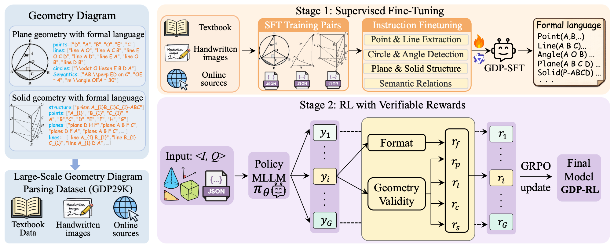
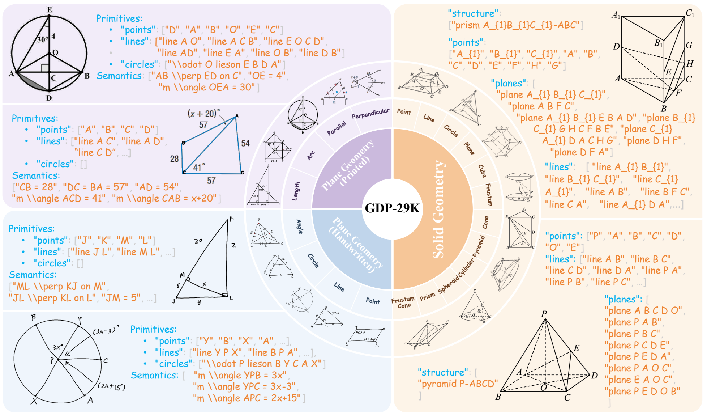

# Geoparsing: Diagram Parsing for Plane and Solid Geometry with a Unified Formal Language

[](https://arxiv.org/abs/2604.11600)
[](https://huggingface.co/datasets/PeijieWang/GDP29K)
[](https://huggingface.co/PeijieWang/GDP-4B)
[](./LICENSE)

Official implementation for the ACL paper:

> **Geoparsing: Diagram Parsing for Plane and Solid Geometry with a Unified Formal Language**  

---

## 🔍 Overview

<p align="center">
  
</p>

Multimodal Large Language Models (MLLMs) have shown strong reasoning ability but still struggle with **geometry understanding**, mainly due to **fine-grained perception bottlenecks**.

This project introduces:

- 🔷 A **unified formal language** for both **plane and solid geometry**
- 🔷 A large-scale dataset **GDP-29K** (20K plane + 9K solid)
- 🔷 A training paradigm combining:
  - Supervised Fine-Tuning (SFT)
  - Reinforcement Learning with Verifiable Rewards (RLVR)

Our method significantly improves **geometry diagram parsing** and boosts **downstream reasoning performance**.

---

## 🧠 Key Contributions

- ✅ Unified formal representation for **2D + 3D geometry**
- ✅ First large-scale **solid geometry parsing dataset**
- ✅ RL-based training with **rule-based verifier**
- ✅ Strong improvements on downstream tasks (Geometry3K, PGPS9K, SolidGeo)

---

## 📊 Dataset: GDP-29K

<p align="center">
  
</p>

- **Total samples**: 28,977
- **Plane geometry**: 19,965
- **Solid geometry**: 8,917
- Includes:
  - Printed diagrams
  - Handwritten diagrams

Each sample is annotated with:

```json
{
  "points": [...],
  "lines": [...],
  "circles": [...],
  "planes": [...],
  "structure": [...],
  "semantics": [...]
}
```
---

## 📖 Citation

If you find this work useful in your research, please consider citing:

```bibtex
@article{wang2026geoparsing,
  title={Geoparsing: Diagram Parsing for Plane and Solid Geometry with a Unified Formal Language},
  author={Wang, Peijie and Zhang, Ming-Liang and Cao, Jun and Deng, Chao and Ran, Dekang and Sun, Hongda and Bu, Pi and Zhang, Xuan and Wang, Yingyao and Song, Jun and others},
  journal={arXiv preprint arXiv:2604.11600},
  year={2026}
}
